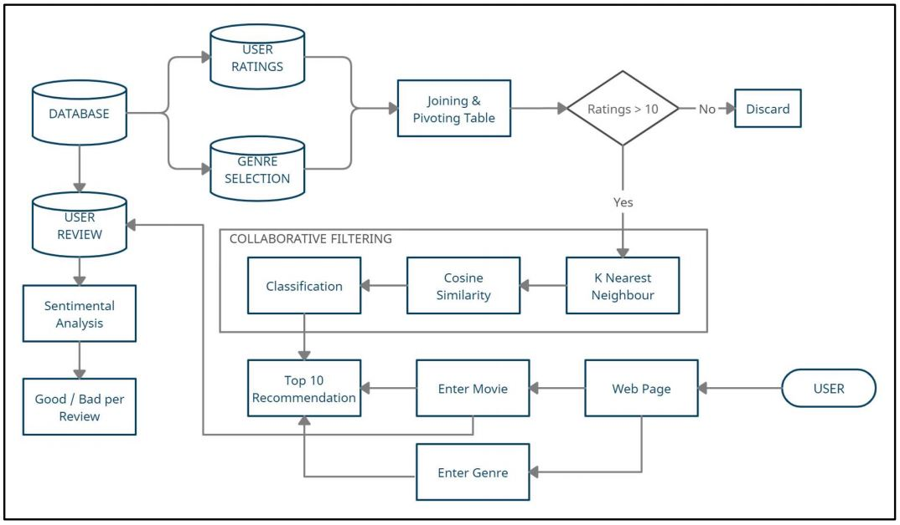

## Movie Recommendation System (Website)
Movie Recommedation System created using Collaborative Filtering (Website) and Content based Filtering (Juypter Notebook).

### Objectives

  1. To create a movie recommendation system using Collaborative Filtering and machine learning algorithms such as K Nearest Neighbours. 
  2. The system should recommend movies based on the movie title entered by the user. 
  3. The system should also be able to recommend movies on the basis of 'genre only' and 'genre and year' entered. 
  4. The system should apply sentiment analysis to categorize user comments on a particular movie.
  5. Additional Content Based Filtering is performed (can be seen [here](Recommovie_9604_Notebook.ipynb)) using Neural Network to perform Matrix Factorization.

### Dataset can be accessed from [here](https://grouplens.org/datasets/movielens/). 
  For redcuing the deployment time, data exploration followed by feature selection is done on the complete dataset.

### Installation
  1. In the shell/cmd, cd to the directory where requirements.txt is located.
  2. activate your virtualenv. (if any)
  3. run:   ``` pip install -r requirements.txt ```

### Flow Diagram
<div align='center'>

</div>

### Deployment
  - The application deployed can be accessed and tested directly from [here](https://recomovie-9604.herokuapp.com/) or https://recomovie-9604.herokuapp.com/

### References
  - https://github.com/kishan0725/AJAX-Movie-Recommendation-System-with-Sentiment-Analysis

NOTE* - This project is implemented with additional features and changes done to the reference link mentioned above.
